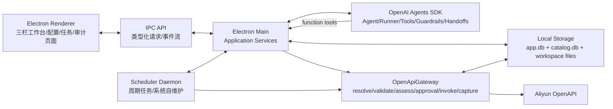
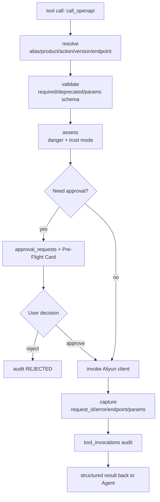

# 阿里云运维 Agent 完整系统设计

状态：设计稿  
范围：本地优先 Electron 桌面端、Agent 编排层、存储层、页面与安全网关闭环  
框架建议：TypeScript + Electron + OpenAI Agents SDK + better-sqlite3/FTS5 + chokidar

## 1. 设计结论

本系统建议采用“本地事实存储 + OpenAI Agents SDK 编排 + 自研确定性 OpenApiGateway”的分层架构。

OpenAI Agents SDK 负责 Agent 定义、工具调用循环、流式事件、上下文注入、handoff/agents-as-tools、guardrails 与 tracing 接口。本地应用继续负责数据主权、安全边界和真实执行：SQLite、文件工作空间、凭证加密、OpenAPI 元数据、人工核签、调度 Daemon、审计账本均运行在 Electron 主进程或本地服务层中。

默认安全配置：

- 禁用 SDK 远端 tracing：设置 `OPENAI_AGENTS_DISABLE_TRACING=1`，并在 `Runner` 配置中设置 `tracingDisabled: true`。
- 不使用 OpenAI-managed conversation state 保存产品会话，使用自定义 SQLite `Session` 后端。
- 不使用 hosted file search 保存业务文档，业务知识只走本地 FTS5/grep。

核心原则不变：

- 模型只表达意图，事实由本地存储提供。
- SDK 负责编排，不负责最终可信校验。
- 所有阿里云调用必须经过 OpenApiGateway。
- 凭证、业务文档、审计数据不上传给模型或外部托管知识库。
- 页面不是“聊天壳”，而是本地事实、短期上下文、执行确权和审计的可视化控制面。

## 2. 架构分层



### 2.1 OpenAI Agents SDK 的定位

使用 TypeScript SDK `@openai/agents` 作为 Agent runtime：

- `Agent`：定义主运维 Agent、API 研究 Agent、任务规划 Agent、总结 Agent。
- `tool()`：封装 `discover_api`、`get_api_params`、`search_workspace`、`call_openapi` 等本地函数工具。
- `context`：每次运行注入 `profileId`、`workspaceId`、`sessionId`、信任模式、数据库连接句柄、权限策略。
- `input/output guardrails`：拦截越权意图、输出结果结构校验、危险操作摘要一致性校验。
- lifecycle hooks：把 `agent_start`、`agent_tool_start`、`agent_tool_end`、`agent_end` 转换成页面事件流和审计记录。
- handoffs 或 agents-as-tools：把“API 元数据检索”“定时任务脚本生成”“执行结果诊断”拆成专家 Agent，但由主 Agent 保持最终用户回复控制。
- human-in-the-loop interruption：工具需要审批时暂停 run，序列化 `RunState`，用户批准/拒绝后恢复同一个根 run。

不建议使用 OpenAI hosted file search 或远端 vector store 承载业务知识，因为本系统的第一目标是数据零出域。业务知识检索应使用本地 FTS5 和文件系统。

不建议启用 SDK 默认远端 trace exporter。若后续确实需要 OpenAI Traces 调试，必须单独提供“开发模式”开关，并明确提示可能包含模型输入、工具调用和工具结果；生产默认使用本地 `audit_events` 与 `run_steps`。

### 2.2 本地服务边界

Electron 主进程提供以下服务：

- `ProfileService`：Profile CRUD、Keychain/Keytar 凭证存取、默认 region 读取。
- `WorkspaceService`：工作空间挂载、chokidar 索引、文件读写确认。
- `CatalogService`：`catalog.db` 只读查询、官方 SDK/spec/文档快照刷新、catalog 版本检查。
- `AgentRuntimeService`：创建 SDK Agent、运行对话 turn、转发流式事件。
- `GatewayService`：唯一 OpenAPI 执行出口。
- `ApprovalService`：生成 Pre-Flight Card、等待用户确认/拒绝、恢复 pending tool call。
- `AuditService`：写入 `tool_invocations`、查询审计页。
- `SchedulerService`：周期任务调度、首次授权、执行日志。

Renderer 只展示状态和发起用户动作，不直接读写密钥、不直接调用阿里云。

## 3. 存储设计

系统使用两个 SQLite 数据库和一个可见文件工作空间。

### 3.1 `catalog.db`

`catalog.db` 是只读接口事实库，可整体替换。它来自 loader 对阿里云官方 SDK/spec/文档最新快照的抽取；接口事实不靠用户手工修改维护。

关键表：

```sql
CREATE TABLE catalog_products (
  product TEXT PRIMARY KEY,
  endpoint_mode TEXT NOT NULL,
  endpoint_tpl TEXT NOT NULL,
  endpoint_map TEXT,
  default_version TEXT,
  source TEXT NOT NULL,
  updated_at INTEGER NOT NULL
);

CREATE TABLE catalog_actions (
  product TEXT NOT NULL,
  action TEXT NOT NULL,
  version TEXT NOT NULL,
  method TEXT NOT NULL DEFAULT 'POST',
  style TEXT NOT NULL DEFAULT 'RPC',
  required_json TEXT NOT NULL,
  danger TEXT NOT NULL,
  summary_cn TEXT,
  params_blob TEXT,
  source TEXT NOT NULL,
  updated_at INTEGER NOT NULL,
  PRIMARY KEY (product, action, version)
);

CREATE TABLE catalog_overlay (
  product TEXT NOT NULL,
  action TEXT NOT NULL,
  deprecated INTEGER NOT NULL DEFAULT 0,
  replaced_by TEXT,
  keywords TEXT,
  note TEXT,
  danger_source_url TEXT,
  maintainer TEXT,
  test_case_id TEXT,
  updated_at INTEGER NOT NULL,
  PRIMARY KEY (product, action)
);

CREATE TABLE catalog_aliases (
  alias TEXT PRIMARY KEY,
  product TEXT NOT NULL,
  kind TEXT NOT NULL
);

CREATE VIRTUAL TABLE catalog_fts USING fts5(
  doc_id UNINDEXED,
  product,
  action,
  summary_cn,
  keywords,
  tokenize='unicode61'
);
```

设计重点：

- catalog 刷新时可重建 products/actions/overlay/aliases，用户库不受影响。
- `danger`、弃用映射、易混别名由 loader 从官方来源和确定性规则派生，不能作为自由文本记忆维护。
- 派生规则必须有代码来源、更新时间和回归用例；安全分类不能是无出处的口头判断。
- `params_blob` 按需懒加载，不进入常驻上下文。
- `dysms -> dysmsapi`、`AddSmsTemplate -> CreateSmsTemplate` 这类失败模式必须成为回归用例。

### 3.2 `app.db`

`app.db` 是用户数据主库，随用户长期保留。

```sql
CREATE TABLE profiles (
  id TEXT PRIMARY KEY,
  name TEXT NOT NULL,
  ak_id_masked TEXT,
  rdc_id TEXT,
  default_region TEXT,
  created_at INTEGER NOT NULL,
  updated_at INTEGER NOT NULL
);

CREATE TABLE workspaces (
  id TEXT PRIMARY KEY,
  name TEXT NOT NULL,
  root_path TEXT NOT NULL,
  active_profile_id TEXT,
  created_at INTEGER NOT NULL,
  updated_at INTEGER NOT NULL
);

CREATE TABLE sessions (
  id TEXT PRIMARY KEY,
  workspace_id TEXT NOT NULL,
  profile_id TEXT NOT NULL,
  title TEXT NOT NULL,
  trust_mode TEXT NOT NULL DEFAULT 'strict',
  status TEXT NOT NULL DEFAULT 'active',
  created_at INTEGER NOT NULL,
  updated_at INTEGER NOT NULL
);

CREATE TABLE messages (
  id TEXT PRIMARY KEY,
  session_id TEXT NOT NULL,
  role TEXT NOT NULL,
  content TEXT NOT NULL,
  run_id TEXT,
  created_at INTEGER NOT NULL
);

CREATE TABLE run_steps (
  id TEXT PRIMARY KEY,
  session_id TEXT NOT NULL,
  run_id TEXT NOT NULL,
  step_type TEXT NOT NULL,
  title TEXT NOT NULL,
  status TEXT NOT NULL,
  payload_json TEXT NOT NULL,
  created_at INTEGER NOT NULL,
  updated_at INTEGER NOT NULL
);

CREATE TABLE session_context_items (
  id TEXT PRIMARY KEY,
  session_id TEXT NOT NULL,
  run_id TEXT NOT NULL,
  tool_call_id TEXT,
  source_type TEXT NOT NULL,
  source_ref TEXT NOT NULL,
  source_hash TEXT,
  title TEXT NOT NULL,
  summary TEXT,
  used_for_param TEXT,
  created_at INTEGER NOT NULL
);

CREATE TABLE approval_requests (
  id TEXT PRIMARY KEY,
  session_id TEXT NOT NULL,
  run_id TEXT NOT NULL,
  tool_call_id TEXT NOT NULL,
  run_state_json TEXT,
  product TEXT NOT NULL,
  action TEXT NOT NULL,
  version TEXT NOT NULL,
  danger TEXT NOT NULL,
  trust_mode TEXT NOT NULL,
  params_json TEXT NOT NULL,
  provenance_json TEXT NOT NULL,
  status TEXT NOT NULL,
  decided_by TEXT,
  decided_at INTEGER,
  created_at INTEGER NOT NULL
);

CREATE TABLE tool_invocations (
  id TEXT PRIMARY KEY,
  session_id TEXT,
  task_id TEXT,
  profile_id TEXT NOT NULL,
  run_id TEXT,
  approval_id TEXT,
  tool_call_id TEXT,
  tool_name TEXT NOT NULL,
  product TEXT,
  action TEXT,
  version TEXT,
  danger TEXT,
  trust_mode TEXT,
  resolved_endpoint TEXT,
  request_params_json TEXT,
  provenance_json TEXT,
  status TEXT NOT NULL,
  error_code TEXT,
  error_message TEXT,
  http_status INTEGER,
  request_id TEXT,
  ak_id_masked TEXT,
  created_at INTEGER NOT NULL
);

CREATE TABLE audit_events (
  id TEXT PRIMARY KEY,
  event_type TEXT NOT NULL,
  actor_type TEXT NOT NULL,
  profile_id TEXT,
  workspace_id TEXT,
  session_id TEXT,
  task_id TEXT,
  ref_table TEXT,
  ref_id TEXT,
  payload_json TEXT NOT NULL,
  hash_prev TEXT,
  hash_self TEXT,
  created_at INTEGER NOT NULL
);

CREATE TABLE workspace_index (
  workspace_id TEXT NOT NULL,
  path TEXT NOT NULL,
  title TEXT,
  mtime INTEGER NOT NULL,
  size INTEGER NOT NULL,
  content_hash TEXT,
  PRIMARY KEY (workspace_id, path)
);

CREATE VIRTUAL TABLE workspace_fts USING fts5(
  workspace_id UNINDEXED,
  path UNINDEXED,
  title,
  content,
  tokenize='unicode61'
);

CREATE TABLE skills (
  id TEXT PRIMARY KEY,
  title TEXT NOT NULL,
  description TEXT NOT NULL,
  body TEXT NOT NULL,
  keywords TEXT,
  created_at INTEGER NOT NULL,
  updated_at INTEGER NOT NULL
);

CREATE VIRTUAL TABLE skills_fts USING fts5(
  doc_id UNINDEXED,
  title,
  description,
  keywords,
  tokenize='unicode61'
);

CREATE TABLE scheduled_tasks (
  id TEXT PRIMARY KEY,
  workspace_id TEXT NOT NULL,
  profile_id TEXT NOT NULL,
  name TEXT NOT NULL,
  category TEXT NOT NULL,
  cron_expr TEXT NOT NULL,
  trust_mode TEXT NOT NULL,
  danger TEXT NOT NULL,
  script_body TEXT NOT NULL,
  status TEXT NOT NULL,
  first_sign_status TEXT NOT NULL DEFAULT 'not_required',
  script_hash TEXT NOT NULL,
  approval_scope_json TEXT,
  approval_expires_at INTEGER,
  max_runtime_ms INTEGER NOT NULL DEFAULT 300000,
  max_retries INTEGER NOT NULL DEFAULT 0,
  created_at INTEGER NOT NULL,
  updated_at INTEGER NOT NULL
);

CREATE TABLE task_executions (
  id TEXT PRIMARY KEY,
  task_id TEXT NOT NULL,
  status TEXT NOT NULL,
  started_at INTEGER NOT NULL,
  finished_at INTEGER,
  log_json TEXT NOT NULL,
  summary TEXT
);
```

凭证 Secret 不进入 `app.db`，只进入系统 Keychain/Keytar。`profiles.ak_id_masked` 仅用于核对和审计展示。

参数来源统一存为 `provenance_json`，结构为：

```json
{
  "RegionId": {
    "value_digest": "sha256:...",
    "display_value": "cn-hangzhou",
    "source_type": "workspace_file",
    "source_path": "环境/region.md",
    "source_hash": "sha256:...",
    "mtime": 1780160000000,
    "quote": "prod=cn-hangzhou",
    "confidence": "high"
  },
  "SignName": {
    "value_digest": "sha256:...",
    "display_value": "杭州虎翊智能科技",
    "source_type": "workspace_file",
    "source_path": "短信/签名.md",
    "source_hash": "sha256:...",
    "quote": "默认签名：杭州虎翊智能科技",
    "confidence": "high"
  }
}
```

审计中心默认是“本地可追溯日志”。如果产品目标升级为企业合规不可抵赖，必须启用 `audit_events.hash_prev/hash_self` 链式 hash、签名导出和备份策略。

### 3.3 文件工作空间

工作空间是真实业务知识源，用户可用编辑器和 Git 管理。

```text
workspace-root/
  环境/region.md
  短信/签名.md
  短信/模板规范.md
  .agent-memory/
    preferences.md
    episodic.md
```

规则：

- `workspace_fts` 只是索引，损坏可重建。
- `.agent-memory/` 与用户业务文档共享索引，但页面和工具需要区分作者与风险。
- 主运维 Agent 不写业务文件或记忆；知识积累由定时任务 Agent 生成候选，并经用户确认后落盘。
- 接口事实类教训不得写入记忆；应通过刷新 catalog 或调整 loader 派生规则回到官方来源重新接地。

## 4. Agent 编排设计

### 4.1 Agent 划分

第一版建议使用 manager 模式，由主 Agent 控制对话与最终回复。

| Agent | 责任 | 工具 |
|---|---|---|
| OpsManagerAgent | 理解用户意图、规划步骤、决定调用哪些工具、生成最终回复 | 全部安全工具，但 `call_openapi` 受网关拦截 |
| ApiResearchAgent | 专门检索 catalog、解释接口差异、给出候选 action | `discover_api`、`get_api_params` |
| WorkspaceGroundingAgent | 查找业务文档、提取参数来源、生成 provenance | `list/search/read_workspace_file` |
| FailureDiagnosisAgent | 读取结构化错误和审计记录，提出自纠策略 | `read_invocation`、`discover_api` |
| TaskPlannerAgent | 生成定时任务脚本草案和首次授权说明 | `load_skill`、只读查询工具 |

这些专家可作为 `agent.asTool()` 暴露给主 Agent，避免把对话控制权频繁 handoff 给子 Agent。后续如果某类长流程需要独立拥有对话，再引入 handoff。

### 4.2 工具设计

SDK function tools 对应本地服务方法：

| 工具 | 风险 | 本地实现 |
|---|---|---|
| `discover_api(intent, product?)` | safe | `CatalogService.searchActions` |
| `get_api_params(product, action, version)` | safe | `CatalogService.getParams` |
| `list_workspace(path?)` | safe | `WorkspaceService.list` |
| `search_workspace(query)` | safe | `WorkspaceService.searchFts`，失败时 grep |
| `read_workspace_file(path)` | safe | `WorkspaceService.read` |
| `search_memory(query)` | safe | 限定 `.agent-memory/` 前缀 |
| `load_skill(id)` | safe | `SkillService.load` |
| `call_openapi(product, action, version, params, region_id?, dry_run?)` | dynamic | `GatewayService.invoke` |
| `query_audit(filters)` | safe | `AuditService.query` |
| `create_scheduled_task(draft)` | dangerous when writes | 创建任务草稿，需确认/首次签署 |

所有工具参数使用 Zod 或 JSON Schema 严格校验。`call_openapi` 不允许模型传 endpoint，endpoint 只能由 catalog 解析。

### 4.3 运行上下文

每次 `Runner.run()` 注入：

```ts
interface RunContext {
  workspaceId: string;
  workspaceRoot: string;
  profileId: string;
  sessionId: string;
  trustMode: 'strict' | 'autopilot';
  db: AppDatabase;
  catalog: CatalogDatabase;
  services: {
    catalog: CatalogService;
    workspace: WorkspaceService;
    gateway: GatewayService;
    approval: ApprovalService;
    audit: AuditService;
  };
}
```

动态 instructions 从存储派生“菜单”：

- 当前 Profile 和 Workspace。
- 文件树摘要，只含路径和更新时间。
- 已装载上下文指针。
- 当前信任模式。
- 可用技能标题。
- 安全纪律：未知即查、写操作经网关、人审前不得声称已执行。

### 4.4 暂停与恢复

审批有**两道闸门**，但判定源都是 catalog 的 `danger` 字段，且必须 fail-safe：

1. **SDK `needsApproval`（执行前，可选/尽力）**：在 execute 之前求值。命中则 SDK 中断 run、序列化可恢复 `RunState`，恢复时直接 `runner.run(agent, state)` 续跑原 agent loop——这是**理想路径**（模型能看到结果、继续轮询、作答）。
   - ⚠️ 实测教训：`@openai/agents` 0.11.6 + 流式 + 多工具调用下，`needsApproval` **对部分 action 不可靠触发**（例如 `ecs/RunInstances` 触发、而 `ecs/RunCommand`、`r-kvstore/CreateInstance` 不触发，三者 catalog 判定均为需审批）。因此**不能只依赖这道闸门**。
2. **Gateway 执行层（执行中，权威/可靠）**：`invokeOpenApiGateway` 每次执行都用权威 catalog 行判定 danger，是**可靠兜底**。未审批的 write/dangerous 到达执行层时，生成审批卡（`run_state_json = deferred_openapi_call`），返回 `AWAITING_APPROVAL`，**绝不发包**。

两道闸门互补、不冲突：SDK 闸门先触发就走可恢复路径；没触发则 Gateway 闸门兜底造卡。每个操作至多一张卡。

> 历史 bug 与修复：早期 Gateway 兜底卡（deferred）的**恢复**只做了“发 API + 写审计”，**没有把结果回灌给模型、也没续跑 agent loop**——于是 `docker ps` 之类的输出被埋进审计、用户在对话里什么都看不到，异步操作（RunCommand 返回 InvokeId）更无人轮询。这才是“确认了好几次都没用”的真身。现已修复：deferred 卡恢复后，执行已审批调用拿到结果摘要，再**续跑一次 agent run**（`resumeDeferredApproval`）把结果回灌，模型据此轮询异步结果并用中文作答。

恢复流程（两条路径统一目标：执行 + 续跑 loop + 给用户答案）：

- **SDK RunState 卡**：`state.approve()` → `runner.run(agent, state)` 续跑原 run。
- **Gateway deferred 卡**：执行已审批 OpenAPI → 把结果摘要作为续跑输入 → `runAgent` 继续完成任务（异步则轮询 `DescribeInvocationResults` 等 safe 接口）→ 写回 assistant 消息并 `emitRunCompleted`。

`danger` 分类遵循 fail-safe：catalog 查不到或等级未知时，一律按 `dangerous` 处理、强制审批，绝不默认放行。

审批恢复必须重建同一 Agent graph，并注入新的 `RunContext`。长时间 pending 时，恢复前要校验 Profile、Workspace、脚本 hash、参数来源 hash 是否仍一致；不一致则要求重新生成审批卡。

**职责边界（三层）：模型只负责“提议操作 + 向用户解释”，系统负责“分类 + 拦截 + 持久化 + 审计”，人负责“裁决”。** 模型永远不是安全控制点——危险操作能否执行由确定性代码保证，而非模型自觉。因此系统提示词中不再写“dangerous 永远等待审批”“审批前先停下叙述”这类把闸门交给模型的规则（见 4.7）。

### 4.5 会话记忆：自定义 Session 后端

这是“Agent 能否把跨轮任务做完”的主梁。Agent 必须在 **run 与 run 之间**保留完整的结构化对话历史并回放，否则每个新回合（尤其被审批打断后开的新 run）都会失忆、从零重做——这正是“点了确认又重新 discover”“盘点能用、变更收不了尾”的根因。

> 现状缺陷（必须修）：当前实现没有实现 SDK `Session`，`Runner.run()` 只传 `userInput` + 最近 12 条消息拍平成的文本；工具结果通过 `writeToolMessage` **只存一行摘要**（`summarizeToolResult`），完整结果（实例 ID、可用规格、InvokeId、错误详情）在 run 结束瞬间丢失。这不是“压缩”，是“丢数据”。

#### 三层记忆模型（行业对齐）

| 层 | 作用 | 业界对应 |
| --- | --- | --- |
| 会话工作记忆（本节） | 模型看得见自己刚做了什么、拿到什么结果；带 compaction | OpenAI Agents `Session`、LangGraph checkpointer |
| 任务状态（4.6） | 跨轮、跨审批盯住一个目标推进 | LangGraph State、Claude Code TodoWrite |
| 长期记忆（mem.md） | 跨会话经验/事实，检索式 | RAG / profile memory |

#### Session 接口（实现 SDK 自定义 `Session`，注入 `Runner.run({ session })`）

- `getItems`：回放当前 session 历史给模型。
- `addItems`：追加模型消息、工具调用、**完整工具结果**。
- `popItem`：支持用户撤回最后一轮后重跑。
- `clearSession`：只清当前 session，不影响同 Workspace 其他会话。

#### 解决“完整 vs 摘要”的矛盾（原 4.5 自相矛盾点）

`messages` 一张表同时服务两类消费者会冲突：模型回放要**全量结构化 items**，UI 展示要**精简摘要**。拆开：

- 新增 `session_items` 表（或等价）持久化喂给模型的**完整 items**（模型消息、工具调用、完整工具结果）；`messages` 仅作 UI 展示的摘要派生视图。
- 真正超大的结果（超过阈值，如 N KB 或列表超过 M 行）外置到 `tool_invocations`/`run_steps` 保存完整 JSON，在 item 里只留 **指针 + 头部摘要**，回放时按需取回。
- 关键纪律：**当前回合刚产生的工具结果必须全量保留**；只对**较早**的轮次做 compaction，绝不丢当前结果。

#### Compaction（上下文管理）

`getItems` 回放策略：近 K 轮全量 + 更早轮次的滚动摘要。摘要只压缩历史 narrative，不丢关键产物（产物钉在任务状态里，见 4.6）。这与 Claude Code / OpenAI 内置 compaction 的做法一致，避免长会话撑爆上下文窗口。

### 4.6 任务状态层

一个**跨轮、跨审批存活**的显式任务对象，是长程运维任务（“开台性价比高的 redis”需要 规划→查可用性→选规格→创建→轮询→报告）稳定收尾的关键。纯消息回放（4.5）对“一句话接力”够用，但对长程任务偏弱；任务状态是把上限拉起来的那一层。

- 存储：`app.db` 新增 `tasks`（goal、plan/steps、status、关键产物如 instanceId/spec/invokeId、pending 澄清问题、已过的审批 gate）。
- 注入：每个 run 把当前任务对象注入 `RunContext`，模型据此“记得自己在做什么、到第几步”。
- 审批是任务里的一个 **checkpoint，不是终止符**：通过后任务自驱续跑（创建→轮询结果→报告），而不是把球踢回用户重开一轮。
- 命令型/异步操作（如 ECS 云助手 RunCommand）：任务状态记录 InvokeId，后续步骤轮询 `DescribeInvocationResults` 取真实结果，禁止假设成功。

### 4.7 提示词分层与职责边界

系统提示词只承担“判断性指导”，不承担“强制规则”与“领域知识”——后两者分别下沉到系统代码与 skills。

- **强制规则下沉系统**：审批拦截、未执行不得声称完成、密钥不出域等，由确定性代码/网关保证（见 4.4），不靠模型自觉。
- **领域知识下沉 skills**：如“ECS 上的容器 = 进 VM 跑 `docker ps` via RunCommand → 轮询 DescribeInvocationResults”，写成可检索的 skill（`search_skills`/`load_skill`），而非塞进系统提示词。把场景知识堆进系统提示词会让其膨胀、指令遵循退化、模型“应试”。
- **提示词只留**：角色、高层操作原则、怎么推进任务（定位→接地→执行/验证→总结）、以及一条硬规则——“该执行就直接发起 `call_openapi`，不要用文字叙述代替工具调用”。
- 反模式（已纠正）：原 ~200 行“必须/禁止”合规清单，把审批、知识、流程混在一起，导致反射式冗余检索与“答一半就停下叙述”。现已精简为“角色 + 原则 + 怎么推进 + 安全交系统”。

### 4.8 运行预算

- `AGENT_MAX_TURNS`、`AGENT_RUN_TIMEOUT_MS` 控制**单个 run 内**的步数与时长上限；调大可让单 run 走更远，但解决不了跨轮失忆（那是 4.5/4.6 的事），且需配合“连续 N 步无实质进展即停”的护栏，避免空耗预算与成本失控。

## 5. OpenApiGateway 设计

唯一调用链：



resolve 规则：

- `product` 命中 `catalog_aliases` 时返回纠正提示，必要时自动改写为 canonical product。
- action 已弃用时 fail-closed，并返回 `replaced_by`。
- action 不存在或必填缺失时 fail-closed。
- region 来源优先级：本次用户明确参数 > 工作空间 `环境/region.md` > Profile 默认值。页面必须展示最终来源。

danger 规则：

- `safe`：查询类，允许自动执行并审计。
- `write`：严格模式需人工确认，免签模式可自动执行但必须审计。
- `dangerous`：永远需要人工确认；v1 禁止 dangerous 自动执行，免签模式也不能绕过人工确认。

策略矩阵：

| 场景 | safe | write | dangerous |
|---|---|---|---|
| 严控核签会话 | 自动执行并审计 | 人审 | 人审 |
| 完全信任免签会话 | 自动执行并审计 | 自动执行并审计 | 人审 |
| 定时任务未首次签署 | 自动执行并审计 | 需要任务授权 | 禁止执行 |
| 定时任务已首次签署 | 自动执行并审计 | 按授权范围执行 | 仅在脚本 hash、参数范围、Profile、有效期匹配时执行 |

## 6. 页面设计

### 6.1 主工作台

主工作台为三栏结构。

第一栏：空间、主体、会话

- Workspace Selector：挂载、切换、显示索引健康状态。
- Profile Selector：选择执行主体、打开 Profile 配置面板。
- Session List：显示标题、绑定 Profile、信任模式、最近状态。
- 底部入口：定时任务、审计中心。

第二栏：短期上下文指针

- 已装载业务文档：文件名、路径、mtime、命中状态。
- 关联接口事实：product/action/version/danger/required/replaced_by。
- Profile 专属记忆：默认收起，只展示条目标题。
- Global Playbooks：技能标题和一句描述。

第三栏：对话与执行区

- Header：可编辑标题、Profile 勋章、信任等级切换。
- Action Stream：用户消息、Agent 思考步骤、工具调用卡、网关折叠链路。
- Pre-Flight Card：高危操作参数、来源、风险说明、拒绝/确认。
- 输入栏：支持 `@` 引用文件、Enter 发送、Shift+Enter 换行。
- 状态条：chokidar、catalog 版本、db 索引、当前 run 状态。

主页面状态来自 `sessions`、`messages`、`run_steps`、`approval_requests` 和实时 SDK hooks。

### 6.2 Profile 配置面板

页面目标：隔离多账号、多业务主体和凭证。

Tab 1：阿里云凭证与环境

- AccessKey ID：明文录入，保存后仅显示脱敏值。
- AccessKey Secret：密码输入，保存到 Keychain/Keytar。
- RDC ID：写入 `profiles.rdc_id`。
- 默认 region：只读展示，提示会被工作空间配置覆盖。

Tab 2：专属代理记忆

- 展示 `.agent-memory/preferences.md` 的结构化条目。
- 支持增删改，但需要保存确认。
- 展示最近 consolidation 时间和冲突提示。

保存后：

- 更新 `profiles`。
- 刷新当前 session 的上下文菜单。
- 重新渲染 pending Pre-Flight Card 中的凭证脱敏标识。
- 写入配置变更审计事件，但不记录 Secret。

### 6.3 定时任务控制台

双窗格：

- 左侧任务列表：业务任务、系统自维护任务两个 Tab。
- 右侧 Deep Inspector：任务名称、cron、Profile、trust mode、danger、脚本正文、最近执行日志。

核心状态：

- `draft`：任务草稿。
- `awaiting_first_sign`：危险任务等待首次签署。
- `active`：可被 Daemon 调度。
- `paused`：暂停。
- `running`：正在执行。
- `failed`：最近执行失败。

危险任务首次运行流程：

1. Agent 或用户创建任务草稿。
2. Gateway 对任务脚本中的 OpenAPI 调用做静态风险扫描。
3. dangerous 任务进入 `awaiting_first_sign`。
4. 用户点击“立即触发测试”。
5. 系统展示首次签署 Pre-Flight Card。
6. 通过后才允许 `active`。

v1 采用受限任务 DSL 或受限 action graph，而不是自由 JS。页面如需展示脚本细节，只展示由 DSL 编译生成的只读 JS 预览，并受以下约束：

- 每个任务版本都有 `script_hash`。
- 首次签署绑定 `script_hash`、Profile、Workspace、danger、参数范围、过期时间。
- Daemon 使用独立进程或 worker 执行，限制网络出口只允许 Gateway。
- 设置超时、取消、并发锁、重试次数。
- 任务修改后回到 `awaiting_first_sign`。

### 6.4 审计中心

审计中心读取 `tool_invocations` 和 `task_executions`。

首版必须支持：

- 按时间倒序列表。
- 按 Profile、状态、product/action、danger、session/task 过滤。
- 展示 AK 脱敏标识、resolved endpoint、request id、错误码。
- 点击详情查看 params/provenance/error 的结构化 JSON。
- 标记 `SUCCESS`、`REJECTED_BY_GATEWAY`、`REJECTED_BY_USER`、`FAILED_BY_ALIYUN`、`SKIPPED_DRY_RUN`。

v1 不补充企业合规导出、签名导出或 hash chain。

## 7. 端到端流程

### 7.1 创建短信模板

1. 用户输入“帮我建个短信模板”。
2. 主 Agent 先加载技能 `sms-template`。
3. 调用 `discover_api("创建短信模板")`。
4. 命中 `dysmsapi/CreateSmsTemplate`。
5. 调用 `get_api_params` 获取参数约束。
6. 调用 `search_workspace("短信 签名")` 和 `read_workspace_file` 获取签名。
7. 从 `环境/region.md` 获取 region。
8. 组装参数和 provenance。
9. `call_openapi` 进入 Gateway。
10. 严格模式生成 Pre-Flight Card。
11. 用户确认后执行。
12. 结果写入 `tool_invocations`，Agent 输出 RequestId 与后续建议。

### 7.2 错误自纠

1. 模型误填 `dysms/AddSmsTemplate`。
2. Gateway resolve 阶段命中 alias 和 deprecated mapping。
3. fail-closed 返回结构化错误：canonical product、replacement action、缺失 required。
4. `tool_invocations` 记录 `REJECTED_BY_GATEWAY`。
5. SDK 工具结果回灌给 Agent。
6. Agent 重新调用 `discover_api/get_api_params`，修正后再请求。

### 7.3 免签模式

免签模式不等于绕过网关。

- safe/write 可按策略自动执行。
- dangerous 永远需要人工确认；免签模式不能自动执行 dangerous。
- 所有自动执行都必须写审计。
- 页面 Action Stream 要明确标识“自动执行原因”和“网关校验结果”。

## 8. 安全设计

### 8.1 数据零出域

不会发送给模型：

- AccessKey Secret。
- 完整工作空间文件，除非用户或 Agent 工具按需读取必要片段。
- `app.db` 全量。
- 审计日志全量。

可发送给模型：

- 用户当前输入。
- 常驻菜单指针。
- 被工具读取的文件内容或片段。
- catalog 查询结果摘要。
- 脱敏 AK ID。
- 结构化错误。

### 8.2 权限与隔离

- session 必须绑定唯一 Profile。
- 工作空间切换后，active session、上下文指针和 agent run context 全部重建。
- Profile Secret 只在 Gateway invoke 前由主进程读取。
- Renderer 不持有 Secret。
- `.agent-memory/` 按 Profile/Workspace 隔离。

### 8.3 审计不可绕过

所有以下行为必须写入审计：

- Gateway 拒绝。
- 用户拒绝/确认。
- OpenAPI 成功/失败。
- 定时任务触发。
- Profile 配置变更。
- 定时任务 Agent 生成工作空间/记忆候选。

审计分两层：

- `tool_invocations`：面向网关调用和工具调用详情。
- `audit_events`：面向追加式事件流，记录关键状态变更，并可选启用 hash chain。

页面如使用“不可篡改证据链”表述，必须先启用 hash chain 和签名导出；否则文案改为“本地可追溯审计日志”。

## 9. 实施路线

阶段 0：工程骨架

- Electron + TS。
- better-sqlite3 migration。
- SDK 最小 Agent run。
- Renderer 事件流。

阶段 1：catalog 与 Gateway

- 构建 `catalog.db` 种子。
- 实现 `discover_api/get_api_params/call_openapi`。
- 实现 fail-closed 和审计。

阶段 2：主工作台闭环

- 三栏工作台。
- session/message/run_steps。
- SDK lifecycle hooks 到 Action Stream。
- Pre-Flight Card。

阶段 3：工作空间与记忆

- chokidar index。
- `list/search/read_workspace_file`。
- `.agent-memory/` 检索；后台定时任务候选、确认写入、去重。

阶段 4：Profile 与凭证

- Profile 配置面板。
- Keychain/Keytar Secret 存储。
- region 来源解析和 provenance。

阶段 5：定时任务与审计中心

- Scheduler Daemon。
- 首次签署。
- Deep Inspector。
- 审计过滤详情。

阶段 6：多 Agent 与优化

- ApiResearchAgent、WorkspaceGroundingAgent、FailureDiagnosisAgent。
- 本地 trace/eval；若启用 OpenAI Traces，必须是开发模式显式开关。
- deferred tools 或工具分组优化。

## 10. 验收用例

- `discover_api("创建短信模板")` 命中 `dysmsapi/CreateSmsTemplate`。
- `call_openapi(product="dysms", action="AddSmsTemplate")` 被 fail-closed，并返回正确产品和替代 action。
- 缺必填参数时 Gateway 阻断，并指出缺失字段。
- 严格模式 write/dangerous 操作生成 Pre-Flight Card。
- 用户拒绝后不发包，审计状态为 `REJECTED_BY_USER`。
- 用户确认后发包，审计包含 resolved endpoint、request id、脱敏 AK。
- 免签模式仍写审计。
- workspace 文件修改后 FTS 索引更新。
- workspace FTS 损坏时 grep 兜底可用。
- 后台定时任务 Agent 写记忆前必须确认，同主题更新而非追加。
- Profile 切换后上下文指针和 pending 操作不串号。
- 定时 dangerous 任务未首次签署前不能 active。

## 11. 已确认产品边界

以下问题已经确认，进入实现时不得再按可选项处理：

- 免签模式永远禁止 `dangerous` 自动执行，必须人工确认。
- v1 必须支持真实阿里云调用；dry-run/mock 只作为开发、测试、演示模式。
- Agent 不允许生成、写入或自动应用接口事实补丁；需要更新时只能触发 catalog 刷新或提示维护 loader 规则。
- 定时任务使用受限 DSL/action graph，不允许自由 JS 执行。
- v1 审计不需要 hash chain 和签名导出。
- v1 是单机单用户，不做多用户操作者身份。
- 企业合规导出不进入 v1。
- 生产默认禁止 OpenAI 远端 tracing；开发模式是否开启必须显式配置。

## 12. 框架选型说明

OpenAI Agents SDK 适合作为本项目的编排层，原因是项目需要代码级控制工具、状态、审批和产品逻辑，而不是纯 hosted workflow。官方文档也将 SDK 路径定位为应用自己拥有 orchestration、tool execution、state 与 approvals 的场景。

但 SDK 不替代以下模块：

- 不替代 `catalog.db`。
- 不替代 `OpenApiGateway`。
- 不替代本地 FTS 检索。
- 不替代 Keychain/Keytar 凭证隔离。
- 不替代审计中心。
- 不替代页面上的人工核签体验。

换句话说：SDK 是 Agent runtime，OpenApiGateway 是安全内核，SQLite/文件系统是真相层，Electron 页面是操作控制面。

参考：

- OpenAI Agents SDK 总览：https://developers.openai.com/api/docs/guides/agents
- OpenAI Agents SDK TypeScript Agent 文档：https://openai.github.io/openai-agents-js/guides/agents/
- OpenAI Agents SDK TypeScript Tools 文档：https://openai.github.io/openai-agents-js/guides/tools/
- OpenAI Agents SDK Human-in-the-loop 文档：https://openai.github.io/openai-agents-js/guides/human-in-the-loop/
- OpenAI Agents SDK Sessions 文档：https://openai.github.io/openai-agents-js/guides/sessions/
- OpenAI Agents SDK Tracing 文档：https://openai.github.io/openai-agents-js/guides/tracing/
