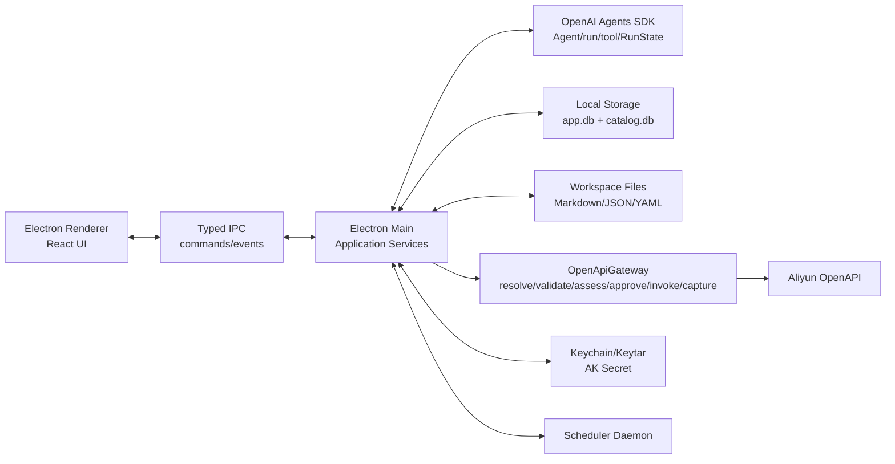

# 阿里云本地运维 Agent Vibecoding 编码文档

状态：编码执行稿
起点：`openapi-gateway-refactor.md`
终点：`docs/main.md`、`docs/ali_profile.md`、`docs/mem.md`、`docs/task.md`、`docs/Security.md`
Agent 框架：OpenAI Agents SDK for TypeScript（`@openai/agents`）
应用形态：本地优先 Electron 桌面端
日期：2026-05-31

## 1. 编码目标

本项目要实现一个本地优先的阿里云运维 Agent 桌面客户端。用户通过三栏式工作台输入自然语言运维指令，Agent 使用 OpenAI Agents SDK 完成工具调用循环，但所有事实、凭证、审计和真实 OpenAPI 发包都由本地系统控制。

最重要的编码约束：

- 模型只表达意图，接口事实必须来自本地 `catalog.db`。
- 所有阿里云调用必须经过 `OpenApiGateway`。
- `endpoint` 不允许由模型传入，只能由 catalog 解析。
- AccessKey Secret 只存系统 Keychain/Keytar，不进模型、不进 renderer、不进 `app.db`。
- 业务知识来自本地工作空间文件，FTS 只是索引，可重建。
- write/dangerous 操作必须经过网关风险评估；严格模式下必须渲染 Pre-Flight Card。
- 免签模式永远禁止 `dangerous` 自动执行；`dangerous` 必须人工确认。
- 审计不可绕过，所有网关拒绝、用户确认/拒绝、OpenAPI 成功/失败都写本地账本。
- v1 面向真实阿里云调用；dry-run/mock 只用于开发、测试和演示模式。
- v1 是单机单用户产品，不做多操作者身份体系。

## 2. 官方 SDK 使用边界

采用 TypeScript SDK `@openai/agents`，因为它提供 Agent、tool、agents-as-tools、guardrails、streaming、session 与 human-in-the-loop 的基础运行时。当前官方文档说明：

- TypeScript SDK 包名为 `@openai/agents`，核心原语包括 Agent、tools、agents-as-tools/handoffs、guardrails 与 tracing。
- SDK 依赖 Zod v4，工具参数 schema 优先使用 Zod。
- Human-in-the-loop 可让工具调用暂停为 `interruptions`，并通过 `RunState` 序列化后恢复。
- Sessions 支持自定义 session 后端，适合把会话持久化到 SQLite。

本项目的边界是：SDK 是编排层，不是安全内核。`OpenApiGateway`、`catalog.db`、本地 FTS、Keychain、审批卡、审计中心仍由应用自己实现。

生产默认禁用远端 tracing：

```bash
OPENAI_AGENTS_DISABLE_TRACING=1
```

应用内也要提供 `tracingDisabled: true` 或等价配置。若后续增加 OpenAI Traces，只能放在“开发模式”显式开关下。

参考：

- https://openai.github.io/openai-agents-js/
- https://openai.github.io/openai-agents-js/guides/agents/
- https://openai.github.io/openai-agents-js/guides/tools/
- https://openai.github.io/openai-agents-js/guides/human-in-the-loop/
- https://openai.github.io/openai-agents-js/guides/sessions/

## 3. 产品页面到功能模块映射

| 页面 | 用户可见能力 | 后端模块 | 数据源 |
|---|---|---|---|
| 主工作台第一栏 | Workspace 挂载/切换、Profile 选择、Session 列表、任务/审计入口 | `WorkspaceService`、`ProfileService`、`SessionService` | `app.db`、工作空间目录、Keychain |
| 主工作台第二栏 | 已装载文档指针、接口事实、Profile 记忆、Global Playbooks | `ContextMenuService`、`CatalogService`、`SkillService` | `workspace_index`、`catalog.db`、`skills` |
| 主工作台第三栏 | 会话流、网关自纠链路、Pre-Flight Card、输入栏 | `AgentRuntimeService`、`GatewayService`、`ApprovalService`、`AuditService` | `messages`、`run_steps`、`approval_requests`、`tool_invocations` |
| Profile 配置弹窗 | AK ID/Secret/RDC ID、只读 region、专属记忆编辑 | `ProfileService`、`CredentialService`、`MemoryService` | `profiles`、Keychain、`.agent-memory/` |
| 智能决策中枢 | 信任模式切换、操作卡片、参数来源、动态自纠 | `AgentRuntimeService`、`GatewayService` | SDK run events、`run_steps`、`provenance_json` |
| 定时任务中心 | 业务任务/系统任务、Deep Inspector、首次签署 | `SchedulerService`、`TaskPolicyService` | `scheduled_tasks`、`task_executions` |
| 审计中心 | 倒序调用日志、过滤、详情 JSON、AK 脱敏 | `AuditService` | `tool_invocations`、`audit_events` |

## 4. 总体架构



Renderer 只负责展示和发起用户动作，不能直接接触 Secret、不能直接调用阿里云 SDK、不能绕过 IPC 写数据库。

## 5. 推荐目录结构

```text
src/
  main/
    app.ts
    ipc/
      channels.ts
      handlers.ts
    db/
      appDb.ts
      migrations/
      catalogDb.ts
    services/
      AgentRuntimeService.ts
      ApprovalService.ts
      AuditService.ts
      CatalogService.ts
      CredentialService.ts
      GatewayService.ts
      ProfileService.ts
      SchedulerService.ts
      SessionService.ts
      SkillService.ts
      WorkspaceService.ts
    agent/
      buildAgents.ts
      tools.ts
      SqliteSession.ts
      instructions.ts
      guardrails.ts
    gateway/
      OpenApiGateway.ts
      AliyunClientFactory.ts
      riskPolicy.ts
      provenance.ts
    scheduler/
      daemon.ts
      taskDsl.ts
  renderer/
    app/
      App.tsx
      routes.tsx
    components/
      workspace/
      profile/
      session/
      context/
      action-stream/
      approval/
      tasks/
      audit/
    state/
      ipcClient.ts
      stores.ts
  shared/
    types/
      ipc.ts
      db.ts
      agent.ts
      gateway.ts
```

## 6. 数据库与本地文件

### 6.1 `catalog.db`

只读事实库。首版必须包含：

- `catalog_products`
- `catalog_actions`
- `catalog_overlay`
- `catalog_aliases`
- `catalog_fts`

必须内置回归事实：

- `dysms` 是 RAM 权限码别名，canonical product 是 `dysmsapi`。
- `AddSmsTemplate` 已下线，替代 action 是 `CreateSmsTemplate`。
- 创建带变量短信模板必须检查 `TemplateRule` 与 `RelatedSignName` 等必填约束。

### 6.2 `app.db`

用户数据主库。首版表：

- `profiles`
- `workspaces`
- `sessions`
- `messages`
- `run_steps`
- `approval_requests`
- `session_context_items`
- `tool_invocations`
- `audit_events`
- `workspace_index`
- `workspace_fts`
- `skills`
- `skills_fts`
- `scheduled_tasks`
- `task_executions`

`approval_requests` 建议结构：

```sql
CREATE TABLE approval_requests (
  id TEXT PRIMARY KEY,
  session_id TEXT NOT NULL,
  run_id TEXT NOT NULL,
  tool_call_id TEXT NOT NULL,
  status TEXT NOT NULL,
  reason TEXT NOT NULL,
  danger TEXT NOT NULL,
  summary TEXT NOT NULL,
  params_json TEXT NOT NULL,
  provenance_json TEXT NOT NULL,
  run_state_json TEXT NOT NULL,
  context_hash TEXT NOT NULL,
  created_at INTEGER NOT NULL,
  decided_at INTEGER
);
```

### 6.3 工作空间

```text
workspace-root/
  环境/region.md
  短信/签名.md
  短信/模板规范.md
  .agent-memory/
    preferences.md
    episodic.md
```

规则：

- `workspace_fts` 由 chokidar 维护，损坏可全量重建。
- 主运维 Agent 不写业务文件或记忆；后台定时任务 Agent 的知识候选必须进入审批。
- 接口事实类教训不能写入自由文本记忆；需要通过 catalog 刷新或 loader 派生规则回到官方来源重新接地。
- Agent 不允许直接生成或写入 catalog 事实补丁；需要更新时只能触发刷新或提示维护 loader 规则。

## 7. Agent 设计

### 7.1 Agent 分工

首版用 manager 模式，不做复杂 handoff：

| Agent | 责任 | 暴露方式 |
|---|---|---|
| `OpsManagerAgent` | 主对话、规划、工具调用、最终回复 | 根 Agent |
| `ApiResearchAgent` | catalog 检索、接口候选解释 | `agent.asTool()` |
| `WorkspaceGroundingAgent` | 查本地文档、提取参数和 provenance | `agent.asTool()` |
| `FailureDiagnosisAgent` | 解释结构化错误、提出自纠策略 | `agent.asTool()` |
| `TaskPlannerAgent` | 生成定时任务草稿和授权说明 | 后续阶段 |

### 7.2 工具清单

| 工具 | 风险 | 本地实现 | 页面呈现 |
|---|---|---|---|
| `discover_api` | safe | `CatalogService.searchActions` | 中栏接口事实卡 |
| `get_api_params` | safe | `CatalogService.getParams` | 中栏 required/params |
| `list_workspace` | safe | `WorkspaceService.list` | 中栏文件树 |
| `search_workspace` | safe | `WorkspaceService.search` | 文档命中卡 |
| `read_workspace_file` | safe | `WorkspaceService.read` | 已装载文档指针 |
| `search_memory` | safe | `.agent-memory/` 限定检索 | 记忆抽屉 |
| `load_skill` | safe | `SkillService.load` | Playbook 卡 |
| `call_openapi` | dynamic | `GatewayService.invoke` | 网关链路/Pre-Flight |
| `query_audit` | safe | `AuditService.query` | 审计中心 |
| `create_scheduled_task` | dangerous | `SchedulerService.createDraft` | 定时任务中心 |

工具实现要求：

- 所有工具参数用 Zod v4 schema。
- `call_openapi` 参数里禁止出现 `endpoint`。
- 工具结果必须包含可用于页面渲染的 `stepId`、`status`、`summary`。
- 大 JSON 存 `run_steps` 或 `tool_invocations`，给模型的结果只保留摘要和必要结构化字段。

### 7.3 运行上下文

```ts
export interface RunContext {
  workspaceId: string;
  workspaceRoot: string;
  profileId: string;
  sessionId: string;
  trustMode: 'strict' | 'autopilot';
  services: {
    catalog: CatalogService;
    workspace: WorkspaceService;
    gateway: GatewayService;
    approval: ApprovalService;
    audit: AuditService;
    skills: SkillService;
  };
}
```

每轮动态 instructions 必须注入：

- 当前 Profile、Workspace、Session。
- 信任模式。
- workspace 文件树摘要。
- 已装载上下文指针。
- 可用技能标题。
- 安全纪律：未知接口先 `discover_api`；写操作进网关；人审前不得声称已执行。

### 7.4 Human-in-the-loop

当 SDK tool 或网关判断需要审批：

1. 生成 `approval_requests`。
2. 序列化 `RunState` 到 `run_state_json`。
3. 写入 `run_steps(status='awaiting_approval')`。
4. IPC 推送 `approval:requested` 给 renderer。
5. Renderer 渲染 Pre-Flight Card。
6. 用户确认后，主进程重建同一 Agent graph，从 `RunState` 恢复并继续 run。
7. 用户拒绝后，写 `REJECTED_BY_USER`，恢复 run 并把拒绝原因回灌给 Agent 生成中止说明。

恢复前必须校验：

- Profile 是否仍一致。
- Workspace 是否仍一致。
- 参数来源文件 hash 是否仍一致。
- 定时任务脚本 hash 是否仍一致。
- 审批是否过期。

## 8. OpenApiGateway 编码合约

唯一入口：

```ts
type InvokeInput = {
  profileId: string;
  sessionId?: string;
  taskId?: string;
  product: string;
  action: string;
  version?: string;
  regionId?: string;
  params: Record<string, unknown>;
  dryRun?: boolean;
};
```

处理链：

1. `resolve`：alias/product/action/version/endpoint。
2. `validate`：弃用、必填、参数 schema、region。
3. `assess`：catalog danger + trust mode + task policy。
4. `approve`：需要人审则创建 approval request。
5. `invoke`：用主进程解密 Secret 后调用阿里云。
6. `capture`：无损记录 request、response、error。
7. `return`：结构化结果回灌给 Agent。

状态枚举：

```ts
type InvocationStatus =
  | 'SUCCESS'
  | 'REJECTED_BY_GATEWAY'
  | 'REJECTED_BY_USER'
  | 'AWAITING_APPROVAL'
  | 'FAILED_BY_ALIYUN'
  | 'SKIPPED_DRY_RUN';
```

风险策略：

- `safe`：严格模式和免签模式都可自动执行并审计。
- `write`：严格模式必须人工确认；免签模式可自动执行，但必须经过 Gateway 校验并写审计。
- `dangerous`：严格模式、免签模式、定时任务场景都必须人工确认；v1 永远禁止自动执行。

fail-closed 错误结果必须包含：

```json
{
  "status": "REJECTED_BY_GATEWAY",
  "error_code": "CATALOG_ALIAS_AND_DEPRECATED_ACTION",
  "message": "dysms 是 RAM 权限码，OpenAPI 产品码是 dysmsapi；AddSmsTemplate 已下线，请使用 CreateSmsTemplate。",
  "canonical": {
    "product": "dysmsapi",
    "action": "CreateSmsTemplate"
  },
  "missing_required": ["TemplateRule", "RelatedSignName"]
}
```

## 9. IPC 与事件流

Renderer 调用主进程：

| IPC command | 参数 | 返回 |
|---|---|---|
| `workspace.mount` | folder path | workspace |
| `workspace.list` | workspaceId/path | entries |
| `profile.save` | profile draft | profile |
| `session.create` | workspaceId/profileId/title | session |
| `session.rename` | sessionId/title | ok |
| `agent.sendMessage` | sessionId/content/mentions | run id |
| `approval.decide` | approvalId/decision/reason | ok |
| `audit.query` | filters | rows |
| `task.createDraft` | draft | task |
| `task.triggerNow` | taskId | execution |
| `task.pauseResume` | taskId/action | task |

主进程推送 renderer：

| Event | 用途 |
|---|---|
| `agent:message.delta` | 流式文本 |
| `agent:step.started` | 工具/推理步骤开始 |
| `agent:step.updated` | 工具结果、状态变化 |
| `gateway:resolved` | 展示 resolved endpoint/action |
| `approval:requested` | 渲染 Pre-Flight Card |
| `approval:decided` | 更新审批状态 |
| `workspace:index.updated` | 更新 chokidar 状态 |
| `task:execution.updated` | 定时任务 live log |
| `audit:row.created` | 审计中心实时追加 |

## 10. 页面实现要求

### 10.1 主工作台

三栏固定语义，不做营销页。

第一栏：

- Workspace 下拉与挂载按钮。
- Profile 下拉与配置按钮。
- Session 列表，展示 Profile 勋章与信任模式。
- 底部任务中心与审计中心入口。

第二栏：

- 文档指针只显示文件名、路径、mtime、命中原因，不显示全文。
- 接口事实显示 product/action/version/danger/required/replaced_by。
- 记忆默认收起。
- Global Playbooks 可点击填入输入框。

第三栏：

- 标题可编辑。
- 信任模式 segmented control。
- Action Stream 以 run_steps 渲染。
- Gateway 自纠链路默认折叠。
- Pre-Flight Card 显示参数、来源、风险、确认/拒绝。
- 输入栏支持 `@` 引用工作空间文件。

### 10.2 Profile 配置

- Secret 输入只在 renderer 短暂存在，保存后清空本地状态。
- `profiles` 只保存 `ak_id_masked`、`rdc_id`、`default_region`。
- 默认 region 只读，最终执行 region 由“用户明确输入 > 工作空间 `环境/region.md` > Profile 默认值”决定。
- 记忆编辑写 `.agent-memory/preferences.md`，保存前确认。

### 10.3 定时任务

v1 不允许自由 JS 直接执行。采用受限 DSL 或 action graph，页面可展示由 DSL 编译出的只读 JS。DSL 边界以“只能声明 Gateway 工具调用、参数来源、条件分支、重试、超时、审计标签”为准，不允许任意网络请求、文件系统写入、shell 执行或绕过 Gateway 的 SDK 调用。

任务状态：

- `draft`
- `awaiting_first_sign`
- `active`
- `paused`
- `running`
- `failed`

dangerous 任务首次签署绑定：

- `script_hash`
- Profile
- Workspace
- 参数范围
- 有效期
- danger 等级

### 10.4 审计中心

首版支持：

- 时间倒序。
- Profile、状态、product/action、danger、session/task 过滤。
- AK 脱敏标识。
- resolved endpoint。
- request id。
- params/provenance/error JSON 详情。

v1 不做 hash chain、签名导出或企业合规导出。页面文案使用“本地可追溯审计日志”，不要写“不可篡改”。

## 11. 实施阶段

### Phase 0：工程骨架

- Electron + TypeScript + React。
- better-sqlite3 migration。
- OpenAI Agents SDK 最小 run。
- IPC 事件流。
- 基础深色三栏布局。

完成标准：用户能创建 session，发送消息，看到流式 Agent 回复。

### Phase 1：catalog 与 Gateway 最小闭环

- 构建 `catalog.db` 种子。
- 实现 `CatalogService.discover/getParams`。
- 实现 `OpenApiGateway.resolve/validate/assess`。
- 实现 `call_openapi`，开发阶段先支持 `dryRun=true`，v1 正式能力必须支持真实阿里云调用。
- 审计 `tool_invocations`。

完成标准：`dysms/AddSmsTemplate` 被 fail-closed，页面展示正确自纠链路。

### Phase 2：严格模式审批闭环

- `approval_requests`。
- RunState 序列化/恢复。
- Pre-Flight Card。
- 用户确认/拒绝审计。

完成标准：write 操作严格模式下不确认不发包，拒绝后 Agent 给出中止说明。

### Phase 3：工作空间接地

- Workspace 挂载。
- chokidar + `workspace_fts`。
- list/search/read/write 工具。
- provenance 生成。
- `@` 文件引用。

完成标准：创建短信模板能从 `短信/签名.md` 与 `环境/region.md` 提取参数来源。

### Phase 4：Profile 与凭证

- Profile CRUD。
- Keychain/Keytar Secret 存储。
- RDC ID。
- Profile 配置弹窗。
- Profile 切换隔离 session context。

完成标准：renderer 不持有持久 Secret，审计只显示 AK 脱敏。

### Phase 5：技能、记忆与页面完善

- `skills`/`skills_fts`。
- `load_skill`。
- `.agent-memory/` search/write。
- 记忆去重与确认。
- 中栏指针完善。

完成标准：Agent 可加载“建短信模板”技能，记忆写入需要确认。

### Phase 6：定时任务与审计中心

- Scheduler Daemon。
- 受限任务 DSL。
- 首次签署。
- Deep Inspector。
- 审计中心过滤/详情。

完成标准：dangerous 任务必须人工确认；未首次签署不能进入 active，免签模式也不能自动执行。

## 12. 核心验收用例

1. `discover_api("创建短信模板")` 命中 `dysmsapi/CreateSmsTemplate`。
2. `call_openapi(product="dysms", action="AddSmsTemplate")` 被 fail-closed，返回 canonical product/action。
3. 缺 `TemplateRule` 或 `RelatedSignName` 时 Gateway 阻断并指出缺失字段。
4. 严格模式 write 操作生成 Pre-Flight Card。
5. 用户拒绝后不发包，审计状态为 `REJECTED_BY_USER`。
6. 用户确认后才发包，审计包含 resolved endpoint、request id、脱敏 AK。
7. 免签模式不绕过网关，仍写审计；`dangerous` 在免签模式下仍必须人工确认。
8. 工作空间新增/修改文件后 FTS 更新。
9. FTS 损坏时 grep 兜底可用。
10. 主运维 Agent 不写工作空间或记忆；知识积累由定时任务 Agent 生成候选并经用户确认后落盘。
11. Profile 切换后上下文指针、pending approval、run state 不串号。
12. 定时 dangerous 任务未首次签署前不能 active，签署后仍按绑定范围执行，不能获得通用免签。
13. 审计中心可按 Profile、状态、action、session/task 过滤。
14. 页面不展示业务文档全文堆砌，只展示指针与来源。
15. Agent 不能写入 catalog 事实补丁，只能触发刷新或提示需要维护 loader 规则。
16. v1 可真实调用阿里云，测试环境可开启 dry-run/mock。

## 13. 给编码 Agent 的总提示词

```text
你正在实现一个本地优先 Electron + TypeScript 阿里云运维 Agent。

底层设计以 openapi-gateway-refactor.md 为准：
- 接口事实必须来自 catalog.db。
- 模型不能凭记忆拼 endpoint/product/action/version。
- 所有阿里云调用必须走 OpenApiGateway。
- 未解析、已弃用、缺必填一律 fail-closed。
- 错误必须结构化回灌给 Agent 并写审计。

页面终点以 docs/main.md、docs/ali_profile.md、docs/mem.md、docs/task.md、docs/Security.md 为准：
- 实现三栏主工作台。
- 实现 Profile 配置弹窗。
- 实现信任模式、网关链路、Pre-Flight Card。
- 实现定时任务控制台。
- 实现审计中心。

Agent runtime 优先使用 OpenAI Agents SDK for TypeScript：
- 使用 @openai/agents 的 Agent、tool、run/Runner、agent.asTool、RunState、custom Session。
- 工具参数用 Zod v4。
- human-in-the-loop 使用 interruption/RunState 序列化恢复。
- 生产禁用远端 tracing。

编码顺序严格按 docs/vibecoding.md 的 Phase 0 到 Phase 6 推进。
每个阶段都必须补齐本地服务、IPC、renderer 状态和验收用例。
不要让 renderer 持有 Secret，不要让模型传 endpoint，不要绕过审计。
免签模式也永远不能自动执行 dangerous 操作。
v1 要支持真实阿里云调用；dry-run/mock 只作为开发测试模式。
Agent 不允许写 catalog 事实补丁，只能触发刷新或提示维护 loader 规则。
产品是单机单用户，不做多用户操作者身份。
审计中心不做 hash chain、签名导出或企业合规导出。
```

## 14. 产品决策

以下边界已经确认，编码时不得再按可选项处理：

- 免签模式永远禁止 `dangerous` 自动执行，必须人工确认。
- v1 必须支持真实阿里云调用；dry-run/mock 只作为开发、测试、演示模式。
- Agent 不允许生成、写入或自动应用 catalog 事实补丁。
- 定时任务采用受限 DSL/action graph，不允许自由 JS 执行。
- v1 审计不需要 hash chain 和签名导出。
- v1 是单机单用户，不做多用户操作者身份。
- 企业合规导出不进入 v1。

## 15. 起点到终点可达性确认

结论：可以从 `openapi-gateway-refactor.md` 的底层设计走到页面终态，路径是闭合的。闭合链路如下：

1. 用户在主工作台输入意图。
2. OpenAI Agents SDK 负责 loop、工具调用、流式事件、RunState 暂停恢复。
3. Agent 通过 `discover_api/get_api_params` 从 `catalog.db` 获取接口事实。
4. Agent 通过 `search_workspace/read_workspace_file` 从本地工作空间获取业务参数，并生成 provenance。
5. 所有真实阿里云调用进入 `call_openapi`。
6. `OpenApiGateway` 执行 resolve、validate、assess、approve、invoke、capture。
7. safe/write/dangerous 按已确认策略进入自动执行或人工确认；dangerous 永远不能免签自动执行。
8. 严格模式或 dangerous 操作通过 `approval_requests + RunState` 渲染 Pre-Flight Card，并在确认/拒绝后恢复同一个 run。
9. 结果和错误写入 `tool_invocations/audit_events`，并以结构化结果回灌 Agent。
10. Renderer 通过 `run_steps`、IPC events、审计查询渲染三栏工作台、上下文指针、网关链路、任务中心和审计中心。

真正的工程关键点有四个，但都不是架构断点：

- catalog loader：需要先做最小种子覆盖短信/ECS/DNS 等核心产品，再逐步扩展全量 SDK 抽取。
- Agents SDK HITL：必须用真实 `RunState` 序列化/恢复做一条审批闭环 spike，确认 Electron 主进程里的恢复方式。
- 阿里云真实调用：开发阶段可先 dry-run/mock，但 v1 必须接入真实 SDK/凭证链，并用低风险 safe API 验证。
- DSL 调度器：定时任务只允许受限 DSL/action graph，不能把自由 JS 当执行入口。

因此编码顺序必须保持 Phase 0 到 Phase 6，不要先做完整页面再补安全内核。最小可行路径是：先完成 catalog + Gateway + call_openapi + 审计，再接 Pre-Flight Card，最后扩展 workspace、Profile、任务和审计页面。
